The GitHub release executor is optional. Without it, Intentional still provides
intent-driven versioning, format-preserving manifest projection, deterministic
release planning, and verifiable annotated release records. The executor adds
repository and publication choreography for maintainers who want that layer
derived from the same configuration.

Adopting the executor means committing its generated workflow to your
repository and owning the result. Inspect the proposed slice with
`intentional executor diff publish`, then apply it with:

```console
intentional executor diff publish --apply
```

The workflow is large because the generated file keeps each authority boundary
and destination-specific command visible in the repository where it runs. This
page is the map for reading it.

## Publish job graph



Each node represents one generated job kind. Every arrow is a direct required
dependency present in the derived workflows used to cover the complete kind
set. A repository configuration determines how many jobs of each kind it needs
and which conditional kinds appear.

The managed job names use your configured job prefix. The default names begin
with `intentional_`.

| Managed job | Work | Authority boundary |
| --- | --- | --- |
| `verify_tag` <!-- intentional-job-kind: verify-tag --><!-- intentional-environment: none --> | Verifies the global annotated tag and exposes its release identity to the graph. | Read-only. It has no protected environment and mints no token. |
| `build_*` <!-- intentional-job-kind: build --><!-- intentional-environment: none --> | Builds one distinct subject once and records its version and digest. A native Cargo archive also fans out by platform before its aggregate build. | Read-only. Build jobs have no publication or repository credential. |
| `tag_before_publication` <!-- intentional-job-kind: phase-before --><!-- intentional-environment: protected --> | Seals the built-subject evidence and pushes the configured `before-publication` tags. | Runs in the protected environment. It mints a short-lived App token only for the tag push. |
| `upload_deliverables` <!-- intentional-job-kind: upload --><!-- intentional-environment: protected --> | Places GitHub-hosted deliverables on the draft Release and writes any draft-asset handoffs publishers need. | Runs in the protected environment. It mints a short-lived App token for the draft Release and cannot publish it. |
| `publish_*` <!-- intentional-job-kind: publisher --><!-- intentional-environment: protected --> | Promotes one sealed subject to one configured destination and records the destination response. | Runs in the protected environment. It receives only that destination's credential and scopes. It cannot write release tags or the GitHub Release. |
| `verify_*` or `retrieve_*` <!-- intentional-job-kind: verifier --><!-- intentional-environment: none --> | Observes one destination through its consumer path, retrieves the published subject with a clean client when the route supports a separate reader, and turns the observation into a verified evidence fragment. | Runs outside the protected environment with read-only repository access. GitHub Package Registry retrieval adds only `packages: read`. An alternate Cargo registry keeps authenticated observation in its publisher job because no maintained read-only credential can be minted. |
| `tag_after_publication` <!-- intentional-job-kind: phase-after --><!-- intentional-environment: protected --> | Seals verified publication fragments and pushes configured `after-publication` tags. | Derived only when a tag declares that phase. It uses the same protected, short-lived App-token boundary as the before-publication tag job. |
| `assemble_evidence` <!-- intentional-job-kind: assemble --><!-- intentional-environment: none --> | Collects verified publication fragments, sealed phase documents, and configured gate contributions into the release evidence. | Read-only. It has no protected environment and no destination or repository-write credential. |
| `close_release` <!-- intentional-job-kind: close --><!-- intentional-environment: protected --> | Uploads and reads back the assembled evidence, attests it, then changes the draft GitHub Release to immutable published state. | Runs in the protected environment. It mints a short-lived App token and holds only the workflow scopes required for attestation. This is the final authority transition. |

The order matters. Tag verification completes before any build. Every publisher
waits for the subject it promotes, the before-publication seal when configured,
and the shared deliverable upload when one exists. Evidence assembly waits for
each destination verifier. Release closure waits for assembled evidence and
configured gates, so the GitHub Release becomes immutable only after the
workflow has collected everything it must carry.

## Job separation

A repository derives jobs for its configured subjects, platforms, and
destinations. Conditional phase tags and deliverable uploads add jobs only when
the configuration requires them.

The main costs buy separate guarantees:

- **Build jobs follow subjects and platforms.** A distinct publishable subject
  gets one build. Multiple destinations share its recorded bytes. Native Cargo
  archives add one build per supported platform and one aggregate job, so each
  platform result is explicit and independently gated.
- **Publication jobs follow destinations.** Each destination gets its own
  publisher and its own credential-separated verifier. A destination failure
  can be retried and reviewed without lending its credential to another route.
- **Verification uses the consumer path.** A publisher's successful command is
  not accepted as proof that consumers can retrieve the result. The verifier
  observes destination state and, where the destination offers a narrower read
  identity, retrieves the subject in a separate clean-client job.
- **Secret-bearing commands remain repository-visible.** Authentication and
  irreversible publication run as derived commands in the repository-local
  publisher job. Intentional's Actions receive sealed paths and schema-backed
  observations for portable verification; they do not receive registry tokens
  or perform destination publication.

Collapsing those jobs would remove a boundary, not just lines. Sharing one build
between destinations is safe because both receive the same sealed subject.
Sharing one publisher between destinations would combine credentials. Moving
publication behind an opaque Action would hide the command that spends them.
Skipping consumer readback would replace observed publication with a client's
success status.

## Authority and credentials

The derived environment name defaults to `intentional-release` and follows a
configured prefix. Create the exact name reported by `intentional executor
init`. The protected environment guards phase-tag pushes, draft-Release upload,
every publisher, and final Release closure. Build, verification, retrieval, and
assembly jobs remain outside it.

Provision credentials at the narrowest boundary that uses them:

- Put destination secrets and variables in the protected environment. A
  publisher can read its own credential while it runs, but its downstream
  verifier cannot.
- Define the release GitHub App identifier as the derived repository variable
  and its private key as the derived repository secret. Phase-tag, upload, and
  closure jobs use them to mint short-lived tokens. A Homebrew publisher mints
  a separate token scoped to the configured tap.

OpenID Connect (OIDC) publishers also name the protected environment in their
registry identity. Configure npmjs and crates.io trusted publishers with that
environment name before applying the workflow. GitHub Package Registry uses a
write-scoped job token in its publisher and a separate `packages: read` token
in its verifier. An alternate Cargo registry reuses its configured token for
authenticated observation inside the publisher instead of copying it into a
second job.

Intentional's first-party Actions verify release identity, record built
subjects, seal phase evidence, verify publication observations, and assemble
evidence. They do not receive the GitHub App private key, destination tokens,
or repository-write token. Repository-local steps mint or read those
credentials at the point that spends them.

Run `intentional executor init` for the exact environment, variable, secret,
and destination credential names derived from your prefixes and publication
configuration. The complete destination-by-destination credential table is in
the [GitHub executor guide](executor.md#publish-to-a-registry-for-the-first-time).

## Generated workflow maintenance

Treat the applied workflow as reviewed repository code. You own the complete
workflow document. Intentional generates the jobs marked by its sentinel step
and suggests replacements when the derived contract changes. Your triggers,
repository jobs, comments, and unrelated metadata remain unchanged.

After configuration or Intentional changes, run `intentional executor check`
and inspect `intentional executor diff publish`. The diff shows the complete
managed slice before you apply it. Repository settings and protected
environment policy remain operator work; the executor reports them but never
changes them.
